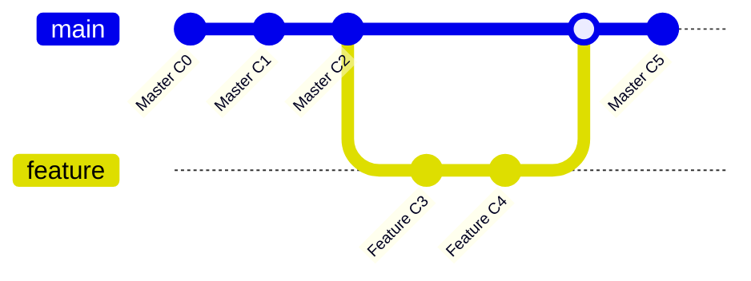
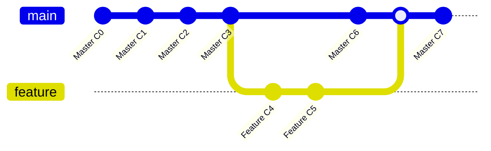

A lot of us use Git, but very few know how it really works under the hood. We mostly just use it with a GUI client or the ones built into our IDEs and code editors. Some of us (myself included) don't even know how to navigate it using the terminal.

This can be detrimental to your projects, as you might run into issues which you won't know how to resolve without fully understanding how Git works on the backend.

In this article I'll be sharing a bit of how Git works behind the scenes and what you should know when working with it.

This article was inspired by a course I took called Collaborative Coding with Git which teaches you how to use Git to collaborate with partners and team members on projects.

Note: This article is not a detailed guide to working with Git. Instead, it's intended to give you a view of what happens behind the scenes when working with Git.

If you want a basic intro to Git and GitHub, [here's a good beginner-friendly guide](https://www.freecodecamp.org/news/git-and-github-for-beginners/).

## Что такое Git  и как он работает?
Git is a distributed version control system that helps developers keep track of changes in their projects. Think of it as an entire timeline of your project from the beginning to the end.

When you create a new project and initialize a Git repository using `git init`, it creates a hidden folder called `.git` which has a bunch of other files and folders inside. These files and folders contain all the content needed for Git to reference that particular directory.


Каталог `.git`.
After initializing the repository, Git starts tracking all the files and folders inside that directory except those you explicitly tell it to not track in the `.gitignore` file. The `.gitignore` file is a hidden that lets you list all the files and folders you don't want Git to track. These files and folders would never be referenced by Git in your project.


The .gitignore file


Inside the .gitignore file

When you're working with git, your files are saved in one of Git's 3 states:
- The Modified State – This is when you add, remove, or change something in a file. Git has noticed the change but you have not formerly informed Git of the change yet.
- The Staged State – This is when you inform Git of the change and tell Git to take note of that change. Commonly known as the "Staging Area", files in this stage are called the Staged Files. You can modify a file even after staging it, which lets you see the file both in a modified state and a staged state. The modifications made after the staging will not appear after a commit has been made.
- The Committed State – This is when Git has saved your modified changes.

You can use the command `git status` to see which states your files are currently in.


When you commit some code, Git takes a snapshot of that particular version of your code which you can reference at a later stage.

So you could say Git is a database of references to your project. That database is built using three types of objects:
- the commits which contain the metadata of every commit such as the message and author,
- the tree of changes which contain references to filenames, file contents, and sometimes other trees,
- and the blob which represents the actual data held within the files.

```sh title="содержимое каталога .git"
$ tree .git -L 1
.git
├── branches
├── config
├── description
├── HEAD
├── hooks
├── index
├── info
├── logs
├── objects
├── packed-refs
└── refs
```


Note: The `.git` folder in some cases is hidden in macOS so you'll have to enable hidden files in your system settings in order to see it.

### Как Git отслеживает изменения ваших файлов
When working with Git, there are many moving parts and sometimes we're working with several different files.

In order for Git to keep track of all these files, it creates something called the Secure Hash Algorithm (SHA), which is a series of cryptographic hash functions, and assigns it to each commit. This makes it easier to identify duplicates and give them the same identifier as the original file, therefore saving storage.

Using the SHA, we can reference anything in Git like looking at a commit and reverting back to it, or just tagging it.


A terminal graph of a Git tree

Every commit except for the initial commit has a parent commit, and when you start a project, your HEAD is pointed at the latest commit on the master or main branch.

This is all maintained using the SHA numbers assigned to the commits. When you create a branch, it creates a separate copy of the files. When you switch branches, the HEAD changes its point to the latest commit on the branch you switched to.

Deleted branches are said to be in a detached HEAD or headless state. We can access them if we have the unique hash, but there's no HEAD pointing at them – so if we don't have their hash, there's no way of accessing them.

We can also keep access to them by checking them out as individual branches.

When working with Git, we often create separate branches for separate tasks such as working on new features or bug fixes. You create branches using the `git branch` command.

```bash
git branch [branch name]
```

When we switch from one branch to another, Git no longer has access to any of the commits in the previous branch. So if we want to revert to a commit in another branch, we have to switch to that branch or rebase our current branch onto the other branch we'd like to use.

I'll talk about rebasing in a second but firstly, I want to talk a bit about merge and merge conflicts.

### Слияние веток Git merge и как оно работает?
When you create a branch for something you're working on in your project, you typically don't want the rest of your work to be affected if you mess something up. So when you finish that task, you'll want to add it to your main project.

The most common way of doing this is by **merging** the branch into the main or master branch of the project.

There are 3 types of merge: the fast-forward merge, three-way merge, and rebasing which I briefly mentioned above.

**Fast-Forward Merge**
Fast-forward merge, as the name implies, is a quick and easy way to merge your branches and continue working on your project. It doesn't require any extra work and you'll rarely run into a merge conflict with it.

This is because all it does is move its HEAD from the current commit of the main branch onto the latest commit of the branch being merged. It's like moving your project forward in time.




Fast-Forward Merge in action

**Three-way merge, on the other hand, requires a bit more work because you're dealing with three commits.**
A three-way merge occurs when the branch you're trying to merge to is ahead of the branch you're trying to merge. For example you create a branch to fix a bug and at the same time, a colleague is working on the main branch. And before you can finish squashing the bug, a new commit has been added to the main branch.

Git won't be able to smoothly integrate your branch into the main branch because the main branch is now ahead of the commit your branch was pointing to.

So it has to create a separate commit for it and combine your commit, the new commit on the main branch, and the commit they're both pointing to (since they both have the same ancestor commit) into one commit in order to merge them as a new commit.




```sh title="git merge feature-branch-1"
Merge branch 'feature-branch-1'
# Please enter a commit message to explain why this merge is necessary,
# especially if it merges an updated upstream into a topic branch.
#
# Lines starting with '#' will be ignored, and an empty message aborts
# the commit.
~
```

Prompt to create third commit for the 3-way merge


3-way Merge successful

**The last method, which is rebasing, transfers the whole feature branch onto the main branch.**
A downside to rebasing which merge doesn't have is loss of project history. When you merge a branch to another branch, you still have access to that branch until you delete it. But when you rebase a branch you lose access to all of that branch's history. This can be good or bad depending on you, (your team), and your project.


Rebasing concept


```sh title="git rebase -i master"
pick 7f393fe feature branch 3 first commit

# Rebase 3510939..7f393fe onto 3510939 (1 command)
#
# Commands:
# p, pick <commit> = use commit
# r, reword <commit> = use commit, but edit the commit message
# e, edit <commit> = use commit, but stop for amending
# s, squash <commit> = use commit, but meld into previous commit
# f, fixup [-C | -c] <commit> = like "squash" but keep only the previous
#                    commit's log message, unless -C is used, in which case
#                    keep only this commit's message; -c is same as -C but
#                    opens the editor
# x, exec <command> = run command (the rest of the line) using shell
# b, break = stop here (continue rebase later with 'git rebase --continue')
# d, drop <commit> = remove commit
# l, label <label> = label current HEAD with a name
# t, reset <label>= reset HEAD to a label
# m, merge [-C <commit> | -c <commit>] <label> [# <oneline>]
#          create a merge commit using the original merge commit's
#          message (or the oneline, if no original merge commit was
#          specified); use -c <commit> to reword the commit message
#
# These lines can be re-ordered; they are executed from top to bottom.
#
# If you remove a line here THAT COMMIT WILL BE LOST.
#
# However, if you remove everything, the rebase will be aborted.
#
```

Prompt to pick a commit to use for the rebasing


Feature-branch-3 rebased

With all the merging and rebasing that's happening across your project, you're bound to come across merge conflicts.

Merge conflicts occur when you make changes to the same position of a file on different branches. For example, you made a change to line 10 of a feature branch you're working on and another person also made a change to that same line on the main branch.

At this point Git won't know which change to go with, so it throws in a merge conflict and refuses to merge or rebase until you manually resolve the conflict.


When a merge conflict occurs, Git pauses the merge and waits for you to resolve the conflicts and continue merging it. You can run a `git status` command to see which files are merged and which are not.

You can resolve the conflicts using Git's conflict resolution markers which look like this when you open the files where the conflict is:

```sh
<<<<<<<<< HEAD
Trying to reproduce a merge conflict # (1)!
=========  # (2)!
Trying to work out a merge conflict
>>>>>>>>> merge-conflict-branch  # (3)!
```

1. изменения, сделанные в текущей/активной ветке
2. разделитель
3. изменения, сделанные на предыдущей ветке

The version above `===` is your current checked out version which is why it has the HEAD pointing at it. The version below is the branch you're trying to merge.

In order to resolve the conflict, you have to decide which version you want to leave and which you want to delete or you have to merge the content manually by yourself. After you choose, you can then continue your merge.

## Как сохранять незакоммиченные изменения (git stash)
Earlier, I talked about the 3 states of Git, which are modified, staged, and committed.

There are times when we want to quickly switch branches without saving the changes we made to the current branch. This might be to make a quick fix or just checking out stuff, and we're not done working on the current branch. We can do that with **stashing.**

Stashing lets you save all your uncommitted work and saves them as unfinished changes which you can later reapply even if you're on a separate branch.

To stash your files, you can use the command `git stash`. This saves all your uncommitted changes in a stack and leaves you with a clean branch. To get a look at your stash, you can use the command `git stash list`. It doesn't save untracked files, though.

```sh
$ git stash
Saved working directory and index state WIP on master: 045f363 added 3 new files
```

```sh title="git stash list"
stash@{0}: WIP on master: 045f363 added 3 new files # (1)!
~
~
~
```

1. stash index. Можно сохранять несколько стешей (тайников)

**Stash List**
When you're ready to apply your stashed changes, just run the command `git stash apply` and it'll apply those changes.

If you have multiple stashes, you can specify which stash to apply by specifying the stash you'd want to apply (for example `stash@{0}`). If you don't specify the stash you want to apply, Git automatically applies the most recent stash changes.

```sh title="git stash apply"
$ git stash apply
On branch master
Changes not staged for commit:
  (use "git add <file>..." to update what will be committed)
  (use "git restore <file>..." to discard changes in working directory)
        modified: newDemo

Untracked files:
  (use "git add <file>..." to include in what will be committed)
        demoStash

no changes added to commit (use "git add" and/or "git commit -a")
```

## Как отменять изменения в Git
When working on any type of project, there are times when we'll inevitably mess up regardless of how careful we are or how efficient our system is. This could be either a human or computer error.

Normally when working with conventional apps and word processors, we just hit an undo button or the shortcut cntrl/cmd + z and we're back to where we were. But when working with Git we don't have that luxury, so we have to go through a few more steps in order fix/undo those errors.

There are a couple of methods we can use to fix/undo these errors, so let's take a look at them one by one.

### Checkout
Checkout is mainly used for switching branches, but can also be used point your HEAD at a particular commit. You can do this by specifying your commit SHA number after the checkout command.

```bash
git checkout [commit SHA]
```

This puts you in a detached HEAD state which you can make temporary or experimental changes to without affecting any of your branches.

After successfully checking out your commit, you can then turn it into a separate branch.

```bash
git checkout -b [name of your new branch]
# или
git switch -c [name of your new branch]
```

```sh title="отмена изменения с помощью checkout"
$ git checkout 045f363 # (1)!
M     newDemo
Note: switching to '045f363'.

You are in 'detached HEAD' state. You can look around, make experimental
changes and commit them, and you can discard any commits you make in this
state without impacting any branches by switching back to a branch.

If you want to create a new branch to retain commits you create, you may
do so (now or later) by using -c with the switch command. Example:

  git switch -c <new-branch-name>

Or undo this operation with:

  git switch -

Turn off this advice by setting config variable advice.detached Head to false

HEAD is now at 045f363 added 3 new files

$ git switch -c commit-turned-branch 
Switched to a new branch 'commit-turned-branch'
```

1. commit SHA
2. новая ветка, созданная из коммита 045f363

Keep in mind, though, that using checkout might lead to loss of your previous branch due to it being in a detached HEAD state.

### Revert
This is the most straightforward way of fixing errors in your repo. Revert, as the name implies, reverses the error by adding a commit ahead of the commit that has the error – but without the error. Think of it as going back and forth in time simultaneously.

Here's an example: you have 2 commits, named "initial commit" and "setting up dev environment". While working, you notice you've made an error in the 2nd commit and want to go back to "initial commit".

When you invoke the `git revert` keyword, it creates a third commit which is exactly the same as taking your repo back to before the second commit happened. With Git revert, you'll need to pass a commit ref and, similar to a 3-way merge, you need to pass in a commit message for the new commit being created.

```sh title="git revert b8ccc51030e2b0a2b7d2245dd2fd0a62a36246f7"
Revert "trying one last time" # (1)!

This reverts commit b8ccc51030e2b0a2b7d2245dd2fd0a62a36246f7.

# Please enter the commit message for your changes. Lines starting
# with '#' will be ignored, and an empty message aborts the commit.
#
# On branch master
# Changes to be committed:
#      modified: revertFile
# Untracked files:
#      demoStash
```

1. новый revert коммит


### Reset
This is the most complex, versatile, and most dangerous way of undoing changes in Git. It is often advised not to use reset in a shared repository because it can lead to huge losses in the project. Okay, with that out of the way, let's see what reset does and how is it different from the other methods.

Git reset has three options. Depending on which you use, it might alter the commit history, the commit history and the staging index, or the commit history, the staging index, and the working directory.

The first one which is `git reset --soft` alters just the commit history. With this, you'll need to specify which commit you'd like to go back to using its ID.

```bash
git reset --soft [commit ID]
```

This deletes all commits that came after the commit you're going back to.


The second one `git reset --mixed` is the default behavior of the `git reset` invocation. It alters both the commit history and the staging index. So if you have any files in the staging area, it unstages those files and if a commit ID is specified it goes back to that commit, deleting all commits that came after it.

```bash
# Both do the same thing
git reset [commit ID]
git reset --mixed [commit ID]
```


The last one which is the most dangerous one and should only be used as a last resort is the `git reset --hard` option. This alters the commit history, the staging index, and the working directory.

So it first goes back to the commit specified by the commit ID, unstages all staged files, and removes all changes done in the working directory. This means if you've modified any files, or added more files, it removes all those modifications and additions from the working directory.

You can see why it's not advised to use this command except when you have no other choice.


The safest way to fix or undo an error is using the `git revert` command. This is because it doesn't alter your commit history but creates a new commit ahead of the one with the error. That way you can still go back to the commit with the error if needed.

## Заключение
I hope this article gives you a clear overview of what happens under the hood when you're working with Git. And hopefully you're now familiar with the most crucial parts of Git you should know when working with it.
If you want to dive deeper into working with Git, I have an [article](https://blog.albasfaisal.com/top-5-resources-for-learning-git) in my blog with some of the best resources for learning Git.