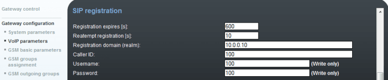

## Логин и адрес для первого подключения, первичная настройка
По документации:
IP address: `192.168.1.2`, маска `255.255.255.0`, шлюз `192.168.1.1`
Логин/пароль=**Admin/2n**.

По факту: статического адреса не было, по умолчанию DHCP. Надо на компьютере запускать DHCP сервер TFTPd32.

!!! warning "Внимание"
    SIM-карты вставлять только после выключения gsm шлюза!

Reset, нажать и держать, пока индикатор не начнет мигать красным — сброс до настроек по умолчанию.
Reset, кратковременное нажатие (полсекунды) — перезапуск gsm шлюза.

После входа задать статический адрес, например:


## Лицензия
На 2N шлюзах до их приобретения стоит временная лицензия, которая ограничивает его пользования до 800 часов. Статус лицензии - Unlocked. Gateway Control→ Firmware/License:


После покупки, у 2N запрашивается лицензия (привязана к серийному номеру) для разблокировки ограничения по времени. Пример лицензионного файла **licence_M201-5415232323.key**:

``` title="licence_M201-5415860438.key"
SERNUM=M201-5415232323
HLIM=0
ME=8
DSS1=no
MONI=no
G729=yes
SIP=yes
TUN=yes
SMS_SMPP=no
SMS_WEB=no
SMS_EMAIL=no
FX=no
SNMP=no
SIGN=ea6f49882bc1198f0f571c7d9dddbd11bb37700e071409c2f6079bed98c4b8da062470e625fb60d9aecd4a22ec5ae1204ef2f8d3adb23651a52edeac5c4a3548
```

Загружаем файл лицензии *Management→ License key*, Choose file. При нажатии на зеленую стрелку шлюз автоматически перезагрузится для применения новой лицензии. После применения лицензии:


Лицензия по времени не ограничена. 453 часа — это сколько отработал шлюз ДО установки лицензии. Открыты опции:
G729 — поддержка кодеков G.729ab,
SIP — поддержка SIP,
TUN — поддержка GSM-CSD remote supervision,
ME8 — поддержка до восьми Mobility Extension.

!!! note "CSD"
    **Circuit Switched Data** ([CSD](https://ru.wikipedia.org/wiki/Circuit_Switched_Data)) — технология передачи данных, разработанная для мобильных телефонов стандарта GSM. CSD использует один временной интервал для передачи данных на скорости 9,6 кбит/с в подсистему сети и коммутации (Network and Switching Subsystem NSS), где они могут быть переданы через эквивалент нормальной модемной связи в телефонную сеть.
    До появления CSD передача данных через мобильный телефон выполнялась за счёт использования модема (такого же, что и в компьютерах), либо встроенного в телефон, либо присоединённого к нему. Из-за ограничений по качеству аудиосигнала, такие системы имели максимальную скорость передачи данных равную 2,4 кбит/с. В то же время, использование в GSM сжатия звука, ориентированного на речь, фактически означает, что скорость передачи данных с использованием такого модема, подсоединённого к телефону, будет даже ниже, чем в традиционных аналоговых системах. С появлением цифровой передачи данных в GSM, CSD предоставил практически прямой доступ к цифровому сигналу, позволяя достичь более высоких скоростей.
    CSD-вызов работает очень похоже на обычный голосовой вызов в GSM сетях. Выделяется единичный временной интервал между телефоном и базовой станцией. Выделенный «повременной интервал» (16 кбит/с) устанавливается между базовой станцией и транскодером, и, наконец, другой временной слот (64 кбит/с) выделяется для передачи данных между транскодером и центром коммутации: Mobile Switching Centre (MSC).
    В MSC возможно преобразование сигнала в аналоговую форму и кодирование его с помощью PCM. Также возможно использование цифрового сигнала по стандарту ISDN и передача его на сервер удалённого доступа.
    Передача данных в сети GSM была улучшена с момента появления CSD. На момент 2006 года, многие GSM-операторы предоставляют услугу CSD. Поскольку максимальная скорость передачи данных для единичного временного интервала составляет 9,6 кбит/с, многие операторы выделяют два и более временных слота для вызовов CSD.
## Настройки VoiceBlue Next. Стык с Avaya
**Параметры шлюза 2N**: ip адрес `10.10.16.2`, порт `5060`, прошивка: `10.36.2.39.29.2`
**Параметры Avaya**: ip адрес sm1 `10.10.16.214`

Схема для старой версии:


### Распределение SIM-карт по группам
Расположение сим-карт слева направо. Номера в примере заменены:
SIM1 - Module 0 SIM card 1 — **89854685555** (есть лицензия на порт).
SIM2 - Module 1 SIM card 1 — **89100825555** (есть лицензия на порт)
SIM3 - Module 0 SIM card 2 — пусто
SIM4 - Module 1 SIM card 2 — пусто

Т.е. у нас лицензированы: первая сим-карта из модуля 0 и первая сим-карта из модуля 1. Вторые: sim-err.


Размещать в разные группы можно только разные модули, а не каждый порт в отдельности.

Оба модуля будут состоять в первой группе для исходящих звонков. Для входящих звонков (Incoming), если нужно входящие на разные сим-карты для двух модулей обрабатывать по-разному, модуль 2 поместить в группу 2. У нас одинаковая обработка входящих, поэтому только группа 1.


### Системные настройки
Во время теста не нужно, но опционально (возможно позже нужно будет) ввести пин-код `0000`, написанный на сим-картах. `End of dialing (empty = off )` — оставляем `#`, как и было.


### SIP транк
Входящие вызовы на GSM шлюз не заработают, если не включить **SIP over TCP for calls** в *Gateway Configuration→ VoIP parameters*. Исходящие звонки с Avaya будут работать даже без галочки.


Пролистать ниже. Проверить порядок кодеков: G711A, G711u, G729.

Настроить SIP proxy (GSM→IP) для входящих GSM звонков. SIP proxy (IP→GSM) для безопасного соединения с трафиком только между Avaya CM. Можно задать ip-адрес и порт, с которого будут приниматься SIP пакеты. Если оставить `0.0.0.0`, он будет открыт для любого трафика.

В разделе IP addresses ввести:
**SIP proxy (IP→GSM):** ip адрес и порт Session Manager
**SIP proxy (GSM→IP):** ip адрес и порт Session Manager
**Ring tone to VoIP:** из выпадающего меню выбрать *From GSM* (проверить, уже был выбран)*.*


Как видно, для `SIP proxy (IP→GSM)` можно задать несколько альтернативных ip-адресов, например Session Manager1, Session Manager 2 и адреса BSM.

Для `SIP proxy (GSM→IP)` можно поставить или один адрес, или `0.0.0.0`, что значит — любой (но так видимо не будет работать).


### Настройка LCR (Least Cost Routing)
Предположим, что у оператора GSM в России префикс 8 и общее количество цифр — 11.


В таблице LCR по умолчанию уже есть настройка для отправки звонков с VoIP на GSM через исходящую группу GSM 1. Если вы используете только исходящую группу `GSM group 1`, **ничего менять не нужно**. Если надо настроить маршрутизацию через разные исходящие группы GSM, читать руководство [Call routing - SIM selection based on called number](https://faq.2n.cz/display/FAQ/Call+routing+-+SIM+selection+based+on+called+number)


### Настройка исходящих групп GSM
Можно задать разные настройки для каждой GSM группы (CLIR, бесплатные минуты, виртуальный рингтон, роуминг и другие). Я ничего не меняла.


### Входящие вызовы
Для входящих звонков можно назначить две группы с разной обработкой звонков и закрепить их за модулями GSM. Настройки схожи с назначением GSM групп для исходящих звонков. Нам это не нужно, в Incoming оба модуля в первой группе в *GSM groups assignment*:


GSM incoming groups — выбрана группа 1. Во входящих  GSM группах можно определить поведение для каждой входящей группы GSM. Выбрать режим Reject, Ignore, Accept incoming calls или Callback. Выбираем **Accept incoming calls + dialtone**.


Пролистать ниже. Можно определить список автоматически обзваниваемых номеров Avaya при отсутствии тонального набора по истечение *DTMF dialing timeout*, если человек ничего не нажал. Нам нужен не список, а только один номер. В General Settings таймаут ставим 0 секунд (DTMF dialing timeout), чтобы звонок сразу шел на внутренний номер `7799` (проверить, что настроен SIP proxy (GSM→IP) в параметрах VoIP).


Пролистать ниже. List of called numbers: `7799` — номер VDN в Avaya, который приходит на вектор 1 (приветствие с донабором внутреннего номера).


Соответствующие настройки в VDN в Avaya CM:

``` title="disp vdn 7799"
display vdn 7799                                                Page   1 of   3
                            VECTOR DIRECTORY NUMBER

                             Extension: 7799
                                 Name*: Test
                           Destination: Vector Number        1
                   Attendant Vectoring? n
                  Meet-me Conferencing? n
                    Allow VDN Override? n
                                   COR: 1
                                   TN*: 1
                              Measured: none     Report Adjunct Calls as ACD*? n
```

**ПРОБЛЕМА ТОНАЛЬНОГО НАБОРА**: для корректного тонального донабора внутренних номеров надо увеличить время ожидания в первом шаге вектора с двух до трех секунд (`wait-time 3 secs`). Когда было две секунды, при донаборе первая цифра часто задваивалась, например набираю 7095 или 7098, а в векторе 7709, и звонок не проходит куда надо. Помогло, когда донабираем внутренний номер сразу после начала приветствия.

``` title="ch ve 1" hl_lines="9"
change vector 1                                                 Page   1 of   6
                                  CALL VECTOR

    Number: 1                Name: Donabor
Multimedia? n      Attendant Vectoring? n    Meet-me Conf? n           Lock? n
     Basic? y   EAS? y   G3V4 Enhanced? y   ANI/II-Digits? y   ASAI Routing? y
 Prompting? y   LAI? y  G3V4 Adv Route? y   CINFO? y   BSR? y   Holidays? y
 Variables? y   3.0 Enhanced? y
01 wait-time    3   secs hearing ringback
02 goto step    6             if ani              in     table 1
03 collect      4    digits after announcement 7701     for none
04 goto step    6             if digits           not-in table 2
05 route-to     digits with coverage y
06 stop
```

**Проблема все ещё периодически наблюдается, если донабирать номер после приветствия (во время паузы):**

``` title="li tra ve 1" hl_lines="11"
23:47:07 TRACE STARTED 12/17/2018 CM Release String cold-01.0.532.0-24891
23:47:12    0  0 ENTERING TRACE cid 2781
23:47:12    1  1 vdn e7799 bsr appl   0 strategy 1st-found override n
23:47:12    1  1 AVDN: 7799 AVRD:
23:47:12    1  1 wait 3 secs hearing ringback
23:47:15    1  2 goto step 6 if ani in table 1
23:47:15    1  2      ani        = [74957258888]
23:47:15    1  3 collect 4 digits after annc 7701 for none
23:47:15    1  3      announcement: board 004V9 ann ext: 7701
23:47:28    1  4 goto step 6 if digits not-in table 2
23:47:28    1  4      digits     = [7709]
23:47:28    1  5 route-to digits with coverage y
23:47:28    1  6 LEAVING VECTOR PROCESSING cid 2781
23:47:28    1  6 TRACE COMPLETE cid 2781
```

## Настройка Avaya CM
### Настройка сигнальной группы (групп) между CM и SM
Группы 3 и 4 были настроены ранее для исходящих звонков в город.
**Group Type:** sip
**Transport Method:** tls
**Near-end Node Name:** procr
**Far-end Node Name:** node-name для SM1 (группа 3) и SM4 (группа 4).
**Near-end Listen Port:** 5063
**Far-end Listen Port:** 5063
**Far-end Domain:** домен, настроенный на Session Manager.

``` title="disp sig 3"
display signaling-group 3                                       Page   1 of   2
                                SIGNALING GROUP

 Group Number: 3              Group Type: sip
  IMS Enabled? n        Transport Method: tls
        Q-SIP? n
     IP Video? y          Priority Video? n        Enforce SIPS URI for SRTP? y
  Peer Detection Enabled? y  Peer Server: SM
 Prepend '+' to Outgoing Calling/Alerting/Diverting/Connected Public Numbers? y
Remove '+' from Incoming Called/Calling/Alerting/Diverting/Connected Numbers? n
Alert Incoming SIP Crisis Calls? n
   Near-end Node Name: procr                  Far-end Node Name: SM1
 Near-end Listen Port: 5063                 Far-end Listen Port: 5063
                                        Far-end Network Region: 1

Far-end Domain: my.company.ru
                                             Bypass If IP Threshold Exceeded? n
Incoming Dialog Loopbacks: eliminate                  RFC 3389 Comfort Noise? n
         DTMF over IP: rtp-payload            Direct IP-IP Audio Connections? y
Session Establishment Timer(min): 3                     IP Audio Hairpinning? n
         Enable Layer 3 Test? y                   Initial IP-IP Direct Media? y
H.323 Station Outgoing Direct Media? n            Alternate Route Timer(sec): 6
```

``` title="disp sig 4"
display signaling-group 4                                       Page   1 of   2
                                SIGNALING GROUP

 Group Number: 4              Group Type: sip
  IMS Enabled? n        Transport Method: tls
        Q-SIP? n
     IP Video? y          Priority Video? n        Enforce SIPS URI for SRTP? y
  Peer Detection Enabled? y  Peer Server: SM
 Prepend '+' to Outgoing Calling/Alerting/Diverting/Connected Public Numbers? y
Remove '+' from Incoming Called/Calling/Alerting/Diverting/Connected Numbers? n
Alert Incoming SIP Crisis Calls? n
   Near-end Node Name: procr                  Far-end Node Name: SM2
 Near-end Listen Port: 5063                 Far-end Listen Port: 5063
                                        Far-end Network Region: 1

Far-end Domain: my.company.ru
                                             Bypass If IP Threshold Exceeded? n
Incoming Dialog Loopbacks: eliminate                  RFC 3389 Comfort Noise? n
         DTMF over IP: rtp-payload            Direct IP-IP Audio Connections? y
Session Establishment Timer(min): 3                     IP Audio Hairpinning? n
         Enable Layer 3 Test? y                   Initial IP-IP Direct Media? y
H.323 Station Outgoing Direct Media? n            Alternate Route Timer(sec): 6
```
### Настройка транковой группы

``` title="disp tru 3"
display trunk-group 3                                            Page 1 of  21

                                 TRUNK GROUP

Group Number: 3                    Group Type: sip           CDR Reports: y
  Group Name: ABK1-SM1-PSTN               COR: 4        TN: 1        TAC: *703
   Direction: two-way        Outgoing Display? n
 Dial Access? n                                  Night Service:
Queue Length: 0

Service Type: tie                 Auth Code? n

                                               Member Assignment Method: auto
                                                        Signaling Group: 3
                                                      Number of Members: 255
```
### Настройка таблицы ARS
Здесь выделила только префикс 8916, чтоб не касалось остальных звонков. Если нужно тестировать с другими, можно добавить в другой `route pattern` или создать свои префиксы.

``` title="li ars an loc 4" hl_lines="14"
list ars analysis location 4
                           ARS DIGIT ANALYSIS REPORT

                            Location:  4

               Dialed            Total        Route    Call      Node    ANI
               String          Min    Max    Pattern   Type     Number   Req

         83                     11     11     40       pubu               n
         84                     11     11     40       pubu               n
         85                     11     28     41       pubu               n
         88                     11     11     40       pubu               n
         89                     11     11     40       pubu               n
         8916                   11     11     2        pubu               n
         9                      6      6      40       pubu               n
```

``` title="disp rou 2"
display route-pattern 2                                         Page   1 of   3
                    Pattern Number: 2      Pattern Name: to SM
    SCCAN? n    Secure SIP? n     Used for SIP stations? n

    Grp FRL NPA Pfx Hop Toll No.  Inserted                             DCS/ IXC
    No          Mrk Lmt List Del  Digits                               QSIG
                             Dgts                                      Intw
 1: 3    0                                                              n   user
 2: 4    0                                                              n   user
 3:                                                                     n   user
 4:                                                                     n   user
 5:                                                                     n   user
 6:                                                                     n   user

     BCC VALUE  TSC CA-TSC    ITC BCIE Service/Feature PARM Sub  Numbering LAR
    0 1 2 M 4 W     Request                                 Dgts Format
 1: y y y y y n  n            rest                               lev0-pvt  next
 2: y y y y y n  n            rest                               lev0-pvt  none
 3: y y y y y n  n            rest                                         none
 4: y y y y y n  n            rest                                         none
 5: y y y y y n  n            rest                                         none
 6: y y y y y n  n            rest                                         none
```

## Настройка Avaya Session Manager
*Elements→ Routing→ SIP Entities→ New*


Для применения настроек нажать **Commit**.

Создать здесь же **Entity Link**.


Нажать **Commit** для применения настроек.

Создать политику маршрутизации **Routing Policy**.


Жмем **Select** и выбираем наш GSM-шлюз из списка. Опять **Select** и для подтверждения **Commit**.


Создать **Dial Pattern**
**Pattern:** 8916
**Min:** 11 as the minimum length of dialed number
**Max:** 11 as the maximum length of dialed number
**SIP Domain:** можно выбрать конкретный или ALL.

Нажать кнопку **Add** в **Originating Locations and Routing Policies**


Выбрать конкретные или ALL.


На этой же странице в Routing Policies выбрать *To_GSM_VoiceBlue*. Нажать Select.


Вернуться в **Dial Pattern** и подтвердить **Commit**. Получаем:


## Стык с Asterisk
**Параметры VoiceBlue Next**: IP адрес `10.0.0.20`, входящий порт `5060`
**Параметры Asterisk**: IP адрес `10.0.0.10`, входящий порт `5060`

Сценарий на рисунке. GSM номера начинаются на 6, 7 и содержат 9 цифр.


### SIP транк 2N VoiceBlue Next
Для настройки транка между **2N VoiceBlue Next** и Asterisk, настроить `SIP proxy (GSM→IP`) для входящих звонков GSM. `SIP proxy(IP→GSM)` предназначен только для безопасного соединения с трафиком от Asterisk. Можно задать IP адрес и порт, на котором будут приниматься IP-пакеты. Если здесь оставить `0.0.0.0`, трафик будет небезопасным.

Чтобы разрешить входящие звонки на Asterisk, зарегистрировать **2N VoiceBlue Next** на Asterisk как тип **Friend** в случае, если нужна регистрация с именем и паролем, или **peer**, если нужна регистрация, основанная на IP адресе и номере порта.

SIP registrar: — ip-адрес Asterisk, который регистрируется на шлюзе.
Registration domain — ip-адрес, на котором шлюз будет зарегистрирован.
Username — имя пользователя, под которым зарегистрируется шлюз.
Password — пароль для регистрации.




### Настройка LCR (Least Cost Routing)
Надо задать префиксы для операторов в стране, где мы находимся. В примере Чехия, где мобильные начинаются с 6 и 7 и содержат 9 цифр.


Надо создать особые инструкции, связывающие префиксы с группами GSM. В **GSM group** определить настройки для SIM карт, назначенных для определенной группы. В **GSM group assignment** назначить модуль для соответствующей исходящей группы GSM.


### Настройка исходящих групп GSM
Каждая GSM группа может иметь свои настройки (CLIR, бесплатные минуты, виртуальные рингтон, роуминг и др.).


### Входящие вызовы
Для входящих вызовов можно определить 2 группы с разным поведением и назначить их модулям GSM. Настройки схожи с **GSM groups assignment**для исходящих звонков.


Во входящих GSM группах можно определить признаки для каждой входящей группы GSM. Выбрать режим для Reject, Ignore, Accept incoming calls илиCallback.


Можно определить список вызываемых номеров. Номер будет автоматически набран после таймаута тонального набора. Это происходит, когда человек не нажал ни на одну цифру до определенного времени. На этой стадии номер маршрутизируется на внутренний номер 100, который является sip-телефоном, зарегистрированным на Asterisk (если задан SIP proxy(GSM→IP) в параметрах VoIP).


### Настройка Asterisk
Для правильной маршрутизации исходящих вызовов на шлюз **2N VoiceBlue Next** и приема входящих вызовов с GSM шлюза на Asterisk.

Исходящие вызовы:

```ini title="/etc/asterisk/extensions.conf"
exten=>_6XXXXXXXX,1,Dial(SIP/${EXTEN:0}@10.0.0.20,,r)
exten=>_7XXXXXXXX,1,Dial(SIP/${EXTEN:0}@10.0.0.20,,r)
```

Сохраняем, делаем `dialplan reload`. Все звонки с 6 и 7 и далее 8 цифр идут на шлюз **2N VoiceBlue Next**.

Входящие вызовы (здесь пример с sip, а не pjsip). Крайне рекомендуется делать запреты на некоторые входящие, чтобы не звонили те кому нельзя.

```ini title="/etc/asterisk/sip.conf"
[general]
port = 5060
bindaddr = 0.0.0.0
allowgues=no
context = sip
disallow=all
allow=ulaw

[VoiceBlueNext]
type=peer
host=10.0.0.20
username=voiceblue
secret=password
fromdomain=10.0.0.20
```

Применить: `sip reload`.
## Переадресация звонка на один номер
Как маршрутизировать звонки непосредственно на номер экстеншена. Ранее было показано, как таким образом звонок уходит на VDN с автоответчиком. Звонок на стороне GSM отвечен после того как отвечен на стороне VoIP.
Все звонки маршрутизируются на номер 100 в VoIP.
Gateway configuration/GSM Group Assignment — все модули разместить в одну входящую (Incoming) группу:


Gateway configuration/GSM Incoming Groups изменить следующие настройки для группы Incoming group 1
- **Mode**: режим установить в `Accept incoming calls + dial tone` (принимать входящие вызовы и тональные сигналы) или `Accept incoming calls + voice message` (принимать входящие вызовы и голосовые сообщения). Второй вариант работает так же, как при установленном `DTMF dialling time-out = 0`.
- **Minimum и Maximum digits in DTMF**: установить правильное минимальное и максимальное число цифр тонального набора (например если надо набирать 100, ввести 3, если надо набирать 10, ввести 2).
- **DTMF dialing time-out**: таймаут тонального набора установить в 0, чтобы шлюз не ожидал никакого набора от мобильного пользователя и вызов немедленно маршрутизировался на номера, указанные в списка набираемых номеров.


Пролистать вниз до списка вызываемых номеров (List of called numbers) и вставить номер 100, который хотим автоматически набирать. Можно ввести несколько номеров: если первый занят, будет вызван следующий.


В пункте *Gateway configuration/VoIP parameters:* проверить, что введен правильный ip-адрес телефонной станции, т.е. шлюз знает, куда направлять вызов.


Настройка сделана. Надо выполнить тестовые вызовы. Примечание: если надо набирать разные номера в VoIP для входящих на каждой SIM карте, поместить GSM модули в разные входящие группы и настроить группы аналогично, за исключением другого номера в списке *List of called numbers*.

Примечание 2: добавить новый маршрут в LCR, если прошивка 1.22 и выше.


## Трассировка
Веб-интерфейс — ограниченная короткая трассировка (максимум 512 Кб), несколько звонков:
*Gateway→ Gateway configuration→ Report configuration*. Поставить галочки везде или на нужных полях.


Внутренняя трассировка *Utils→ Report capture*. Запустить и сделать тест.


После теста немного подождать перед скачиванием файла. Просмотреть в онлайн внутреннюю трассировку: *Gateway→ Gateway control→ Online report* (не отобразилось)

Через PuTTY — telnet (порт 23), длинная «неограниченная» трассировка. Размер файла трассировки ограничен возможностями компьютера: в PuTTY *Session→ Logging*, выбрать **Session logging: All session output** и выбрать файл, в который будет сохраняться вывод трассировки.
логин Admin, пароль (???)

Для прошивки 1.25+

| код                                              | описание                                                                                                                                |
| ------------------------------------------------ | --------------------------------------------------------------------------------------------------------------------------------------- |
| `AT%X91=3F,3,0`                                  | Полная трассировка звонков включая LCR                                                                                                  |
| `AT%X92=7,0`                                     | Полная трассировка SMS                                                                                                                  |
| `AT%X92=0,7`                                     | Полная трассировка SMPP                                                                                                                 |
| `AT%X92=7,7`                                     | Полная трассировка SMPP и SMS                                                                                                           |
| Комбинация команд `AT%X91=3F,3,0` и `AT%X92=7,7` | Самая полная трассировка                                                                                                                |
| `AT&S`                                           | Статус вставленных карт и модулей                                                                                                       |
| `ATI3` и `ATI4`                                  | Информация о шлюзе и установленных лицензиях                                                                                            |
| `AT&GALL=RESET`                                  | Перезапуск модуля                                                                                                                       |
| `AT!RP`                                          | Запуск трассировки. Если пришел ответ Занято (BUSY), выполнять сначала AT!RX для очистки предыдущей неправильно завершенной трассировки |

Вендору отправляются номера, на которые пытались звонить и отправитьSMS, детали сценария вызова (что необходимо достичь — например маршрутизация определенных номеров на разные модули/SIM карты).
## Прошивки
Обновлять из веб-интерфейса: *Management → Firmware update*

2N VoiceBlue Next, 2N VoiceBlue MAX, 2N BRI Lite, 2N BRI Enterprise,2N StarGate, 2N BlueTower. Несмотря на то что прошивка общая, некоторые функции будут работать только на определенной модели.

**1.36.2.39.2 (December/2018)**
- SIMs национальных виртуальных операторов работают без настроек роуминга
- Прямой SIP вызов на VoIP возможен без CLI номера
- детектор тональных сигналов DTMF из fix network в mobile network можно отключать
- длина пароля пользователя SMS увеличена до 15 символов
- SMTP/POP3 порты выключены без лицензии SMS to Email
- количество SMTP/POP3 соединений увеличено до 15
- поддержка %23 в SIP URI

**Изменения в конфигурации по умолчанию**
- посылать 200 OK на запрос REGISTER (VoIP)
- следующая попытка регистрации: 20 (GSM Basic)
- Принимать Incoming Call+Voice Message (GSM Incoming)
- Минимальное число цифр в DTMF:0 (GSM Incoming)
- Максимальное число цифр в DTMF:4 (GSM Incoming)
- DTMF dialing timeout: 5 (GSM Incoming)
- Minimum digits: 8 (GSM Basic)
- Maximum digits: 16 (GSM Basic)
- Default count of digits: 8 (Prefixlist1)

**Улучшения**
- SMS, SMPP, NTP, IP процессы

1.35.x, 1.32.х (неофициальные релизы)

**1.31.1.34.1 (May/2017)**
Новые функции:
- Емкость таблицы AutoCLIP увеличено до 512 записей
- Длина SMS сообщений по неответу или после успешного вызова увеличено до 147 символов

Баг-фиксы и улучшения:
- Длина номера VoIP в GSM number увеличена до 31 символов.
- Улучшено DLR спаривание для Cinterion MC55i-w
- Установка GSM модуля в качестве хранилища по умолчанию для входящих SMS
- Улучшение записей CDR для симуляции вызовов (с сервером 2N SIM Star)
- Улучшена совместимость с Siemens HiPath 4000 (2NBRI Lite/Enterprise)
- Обновлены ссылки на википедию 2N Wiki в браузере

1.30.x (no official release)

**1.29.1.32.3 (October/2016)**
Новые функции:
- SMS буфер увеличен до 10000 сообщений (2N VoiceBlue Next/2N VoiceBlue MAX)
- SMS буфер увеличен до 20.000 сообщений (2N StarGate/2N BlueTower)
- Добавлена поддержка до 32 независимых SMPP сессий (2N StarGate)
- Добавлен параметр «Waiting for delivery expires in *минуты*» для ускорения auto-DLR для недоступных номеров
- Добавлен параметр «Delay for change of SIM in *секунды*» , чтобы опционально ожидать входящие DLRs перед неожиданным разлогированием SIM

Баг-фиксы и улучшения:
- Increased capacity of the IMSI-DLR pairing database to 2000 IMSIs
- Added autoerase of non-used IMSIs from the database
- Added autoerase of incomplete SMS received over SMPP from the database after 10 min
- DLR pairing fix for multiple modules (cid fix)
- SMS activation with concatenated message fix (with 2N SIM Star Server)
- Добавлено поле \"Contact\" в сообщение SIP NOTIFY
- Багфикс совместимости SIP для Genesys proxy
- Багфикс отправки символа \# с VOIP на GSM
- Багфикс поля Branch в Via для пакетов 2xx SIP
- Номер 112 добавлен к списку номеров экстренных служб (появляется после factory reset)
- PISDN2 WDOG fix (2N StarGate/2N BlueTower)
- Исправлены статусы и IDs для некоторых сообщений SNMP
- Исправлены метки на испанском языке.

Примечание:
If the report capture is running, the selection speed of completeconcatenated SMS to be send from the queue is decreased to 10SMS/second.
If the report capture is inactive, the selection speed of concatenatedSMS in the outgoing queue is 100 SMS/second.

**1.28.0.31.0 (July/2016)**
- Полная поддержка SNMPv2 мониторинга, конекретнее запросы GETRequest, GETNextRequest и SETRequest (нужен лицензионный ключ SNMP)

**1.27.3.30.3 (June/2016)**
SMS исправления и улучшения:
- Fixed stuck of concatenated SMS in the queue
- Fixed stuck of the SMS queue (xE910)
- Adjusted SMS priority → 1st reading and erasing SMS/DLR (after +CDSI/CMTI), 2nd sending outgoing SMS
- Fixed international number format when \"+\" is being used over SMPP
- Fixed timeout for SMS erase from module/SIM
- Fixed erasing of received SMS and DLR for massive messaging
- Added autorestart of the module when messaging freeze detected (xE910)
- Fixed DLR pairing on HE910
- Fixed restart of HE910 after REF 255 → 1 change
- Fixed concatenated SMS (autowait for module ready state)
- Increased capacity of SIM Client for received messages to 20 SMS (xE910)

Другое:
- Fixed DTMF during alerting for HE910 with FW 12.00.207
- Fixed call status on the web for 2N StarGate/BlueTower
- Adjusted web labels for 2N BRI Lite
- Fixed CLIP transfer for FXS on 2N VoiceBlue MAX

**1.26.3.29.4 (February/2016)**
Исправления и улучшения:
- WDOG restart fix (2NStarGate/BlueTower)
- DLR over SMPP fixes (delivery timeout to SMSC/ESME after 3 tries, adjusted DELIVSM, err:000 in SMS-Delivery message)
- Optional USSD session timeout
- AT commands improvements (at&x#, at&vq#, at!rp,# - adjustable amount of tracing rows)
- Improved DTMF detection GSM-\>VoIP, PRI-\>GSM (2NStarGate/BlueTower)
- DTMF/RTP-EVENT marker fix
- Fix of the timestamp in pcap trace
- Email2SMS fix (max. SMS per email)
- Simulated call timeout fix (with 2NSIM Star Server)
- Improved handling of CREG:3 detection (with 2NSIM Star Server)
- (Timeout for registration→ Number of registration attempts/Delay after registration denied→Regerr/Netwerr detection by 2NSIM Star Server)
- Web compatibility with Chrome browser
- Longer web browser autorefresh after restart and upgrade
- AoC fix for calls to GSM
- NTP synchronization fix for DST
- BTS Lock view fix on web
- SDR fix for SMS over web
- Ringing timeout fix for AutoCLIP table records
- Improved compatibility with Aastra MX-ONE PBX

**1.25.0.28.4 (June/2015)**
Новые функции:
- NTP клиент
- Audio volume adjustment for all GSM/UMTS module types
- New GUI of the GSM/UMTS modules status view (2NSIM Star Server look)
- Detailed SMS/SMPP report capture from the web
- Multiple outbound SMS web users together with Email2SMS/SMPP enabled (SMSW license key needed)
- New features support of 2NSIM Star Server version 1.25

Исправления и улучшения:
- New communication with the RTC over i2c (2NVoiceBlue Next/MAX)
- MCC+MNC selection forcing for remote SIM cards (with 2NSIM Star Server)
- Improved SIP communication over TCP/UDP
- Table of accepted prefixes reset fix
- Email2SMS with attachment fix
- Improved ISDN PRI communication (2NStarGate/BlueTower)
- Improved compatibility with Telit HE910-EUR boards with USB (2NStarGate/BlueTower)

**1.24.0.27.6 (January/2015)**
Новые функции:
- Q.850 release causes from GSM to SIP according to RFC3326
- User adjustable EnquireLink timeout for SMPP
- New features support of 2NSIM Star Server version 1.24

Исправления и улучшения:
- Default value in prefixlists 8+
- 32 Outgoing GSM Groups assignment for small gateways (2NBRILite/Enterprise, 2NVoiceBlue Next/MAX)
- Long/special characters user name fix
- Calls and SMS statistics fix
- SDR improvement for outgoing SMS
- SMS validity and time stamp improvement for SMPP
- DTMF transfer over SIP before connect support for Telit GE910 (FWGE910-13.00.006-A014 or higher needed)
- DTMF transfer over SIP before connect fix for Cinterion MC55i/i-w,Telit UC864-G, Wavecom Q55/WMP100 GSM modules
- Call simulation fix (with 2NSIM Star Server)
- USSD and IVR activation fix (with 2NSIM Star Server)

**1.23.0.26.4 (January/2015)**
Новые функции:
- Repeated registration tries when no network detected
- Non-standardized SMS DLR support - incoming SMS as DLR
- Non-standardized SMS DLR support - changed prefix match
- Email domain name length increased to 63 characters
- User login and password length increased to 30 characters
- User adjustable CallBack delay
- New features support of 2NSIM Star Server version 1.23

Исправления:
- Major call routing fixes
- CZ/EN/ES GUI fixes
- Improved compatibility with Wavecom Q55/WMP100 GSM modules
- Improved compatibility with Cinterion MC55i/i-w GSM modules
- Improved compatibility with Telit UC864-G UMTS modules
- SMS messaging routing fix
- SDR reading/writing fixes
- Improved communication with RTC
- ISDN communication with Alcatel PBXs (2NStarGate/BlueTower only)

Please note that some call routing configuration may not apply if youupgrade your gateway from the FW version 1.19.x to the FW version1.2x.x. It is recommended to proceed the factory reset after an upgradeand re-configure the gateway manually again.

For further product information see please the latest user guides and FAQs at http://wiki.2n.cz

**1.22.0.25.4 (October/2014)**
Основные изменения:
- Up to 32 GSM groups for independent incoming/outgoing calls routing
- New Least Cost Routing Table with extended prefixes and from/to anyport/interface routing optionality
- Removed \"Port modes\" menu, all routing merged to the LCR table

For further details about the new routing configuration see please the latest user guides and FAQs at http://wiki.2n.cz

Другие новые функции:
- Heavy SMS messaging optimization for multiple SMPP accounts
- User adjustable SMS Lifetime parameter
- SMS sending from the web interface together with Email2SMS/SMPPenabled
- Call duration adjustable by seconds
- Button \"Clear call statistics\" for selected module
- CDR records for simulated calls (with 2NSIM Star Server)
- SDR records for all SMS (SMS at no answer/Web SMS/SMS Simulation\...)
- User adjustable USIM/SAT support for Telit xE910 modules
- DTMF transfer over SIP before connect
- Repeated SMS sending tries (for CMS errors 38, 41, 42, 50, 102, 192,212, 255, 256, 258, 300, 314, 331, 332, 500, 521 and 522)
- NOSC license (optional)
- Support of credit checking from SMS (with 2NSIM Star Server)
- Support of free minutes for prepaid SIM (with 2NSIM Star Server)

Исправления:
- Release causes reading from GSM modules
- CZ/EN/ES GUI fixes
- Minor call routing fixes
- Email2SMS fix
- RTC freezing detection and improved start/stop
- Major changes of the remote SIM communication (with 2NSIM StarServer)
- ISDN communication handshake (optional channel ID,2NStarGate/BlueTower only)
- Compatibility with Cinterion MC55i GSM modules
- Busytone fix for FXS ports (2NVoiceBlue MAX only)
1.21.x (no official release)
1.20.x (no official release)

**1.19.2.22.8 (June/2014)**
Fixes:
- No audio issue on Telit GE910 GSM board with 4SIM/channel(2NStarGate/BlueTower only)

**1.19.1.22.7 (May/2014)**
Новые функции:
- Blocked SIM card detection/Failed calls - based on selected disconnection/release causes only (with 2NSIM Star Server)
- Repeated GSM network registration tries (1-50 tries) with registration timeout (0-3600s)
- Audio gain settings from the web interface (2NStarGate/BlueTower only)
- Report capture - details about trace takeover
- Long credit balance support (with 2NSIM Star Server)

Исправления:
- Default values and GUI corrections
- Email2SMS - IMSI in the email subject (%s) fix
- Autoband selection fix for Telit xE910
- BTS Lock view on the web for Telit UC864
- IP Whitelist improvement
- SIM Client cache improvement (with 2NSIM Star Server)
- RTC freezing detection and autorestart
- CDR/SDR improvement
- SMPP re-connection timeout increased to 65 seconds

**1.18.2.21.7 (March/2014)**
Исправления:
- STK deactivation fix
- Improved GSM network\'s logging and operability processes
- SIM Client caching improvement (with 2NSIM Star Server)

**1.18.1.21.6 (March/2014)**
Новые функции:
- CDR and SDR capacity increased to 100.000 records
- Direct USSD entry from the web interface
- CLIP Routing Table capacity increased to 256 records
- Auto CLIP Routing Table capacity increased to 256 records
- LCR Table capacity increased to 256 records
- Manual network selection (MCC+MNC)
- Call statistics for remote SIM cards (with 2NSIM Star Server)
- Automatic band selection for Telit xE910 modules
- Deliver incoming SMS to all (up to 10) users for Email2SMS
- \"A\" number view in the call status on 2NStarGate
- User adjustable GSM logging timeout (NWAIT range 1-10 minutes)
- Manual STK activation/deactivation

Исправления:
- SMPP improvements
- GSM network logging timeout
- Improved compatibility with Telit xC864 modules
- IMEI changing fix for Telit xE910 modules
- CDR/SDR download waiting screen
- SMS users fix
- Tone detector fix
- SIP communication delay
- GUI corrections

Warning: After an upgrade to the FW version 1.18.1 from any previous version will be all existing CDR records deleted.

**1.17.1.20.5 (December/2013)**
Новые функции:
- Long SMS in SMPP (multiple packets support)

Исправления:
- Failed recharging detection (with 2NSIM Star Server)
- Email2SMS compatibility improvement
- GUI corrections

**1.17.0.20.3 (November/2013)**
Новые функции:
- Flash SMS
- Heavy SMS messaging optimisation (up to 10 SMS/module/min)
- \"3G BTS Lock\" for UMTS module Telit HE910
- Spanish web interface
- Secured IP address whitelist
- Email2SMS email subject modification

Исправления:
- Improved compatibility with Avaya CM 6.3
- Major system stability fixes
- Optional parameters for PRI synchronisation fix(2NStarGate/BlueTower)

**1.16.2.19.3 (September/2013)**
Новые функции:
- SDR records
- SMPP delivery report
- SMS Simulation (with 2NSIM Star Server)
- Manual UMTS band selection for Telit HE910
- SMPP tracing

Исправления:
- Higher priority for outgoing SMS
- Improved stability of Telit xE910
- Long SMS in SMPP (one packet support)

**1.15.0.18.1 (Jul/2013)**
Новые функции:
- BTS lock for GSM Telit GE910
- Manual GSM network blocking
- CLIP to FXS (2NVoiceBlue MAX)
- Voice message recognition (for ported number detection)

Исправления:
- RTC improvement
- PRI synchronisation fix (2NStarGate/BlueTower)
- Improved AoC forwarding to ISDN
- Improved SIP/TCP registration

**1.14.0.16.2 (Jun/2013)**
Новые функции:
- Multi language web (EN+CZ)
- SNMP support
- CDR statistics for ignored incoming call

Исправления:
- Improved communication with Telit GSM/UMTS modules
- Mobility Extension fixes
- Improved AutoCLIP Routing for SMS
- Improved GUI

**1.13.0 (May/2013)**
Исправления:
- Minor bug fixes

**1.12.0 (Apr/2013)**
Новые функции:
- Linear selection of GSM modules
- Telit GSM/UMTS modules GE910/HE910 support

Исправления:
- Improved communication with Wavecom GSM modules

**1.11.0 (Mar/2013)**
- Email2SMS/SMS2email support (POP3/SMTP)
- Licensing with the license file

Исправления:
- GUI improvement for different browsers

**1.10.0 (Feb/2013)**
Исправления:
- Improved DTMF detection in DISA
- SMPP fixes

**1.9.1 (Jan/2013)**
- GPRS activation support
- GSM codec configuration (EC, NR, HR, AMR)
- SMPP protocol support (SMSC/ESME)
- Audio for simulated calls (with 2NSIM Star Server)

## Бэкап настроек
Management → Configuration download → Save to disk)


## Тест
Набираю любой мобильный номер, начинающийся на 8916.


Тест входящих, донабор 7098 после приветствия:

``` title="li tra vdn 7799"
list trace vdn 7799
                                LIST TRACE VDN

          vec
time      prt st data

01:14:26 TRACE STARTED 12/18/2018 CM Release String cold-01.0.532.0-24891
01:14:30    0  0 ENTERING TRACE cid 2848
01:14:30    1  1 vdn e7799 bsr appl   0 strategy 1st-found override n
01:14:30    1  1 AVDN: 7799 AVRD:
01:14:30    1  1 wait 3 secs hearing ringback
01:14:33    1  2 goto step 6 if ani in table 1
01:14:33    1  2      ani        = [74957258888]
01:14:33    1  3 collect 4 digits after annc 7701 for none
01:14:33    1  3      announcement: board 002V9 ann ext: 7701
01:14:37    1  4 goto step 6 if digits not-in table 2
01:14:37    1  4      digits     = [7098]
01:14:37    1  5 route-to digits with coverage y
01:14:37    1  6 LEAVING VECTOR PROCESSING cid 2848
01:14:37    1  6 TRACE COMPLETE cid 2848
```

## Проблемы
**Что делать, если 2N Xapi Server не соединяется с 2N VoiceBlue Next**
Настроить конфигурационный файл `C:\UsersUSER_NAME\AppData\Roaming\2NTELEKOMUNIKACE\XAPI Server\omegasrv.ini` (Windows Vista или 7) или в установочном каталоге Xapi сервера (Windows XP).

Найти секцию с настройками шлюза `[SMS-EGX]`, где X представляет номер шлюза в настройках *Xapi Server SMS module*. Найти строку с IgnoreCR и заменить её на `IgnoreCR=1`. Сохранить и перезапустить 2N Xapi Server.